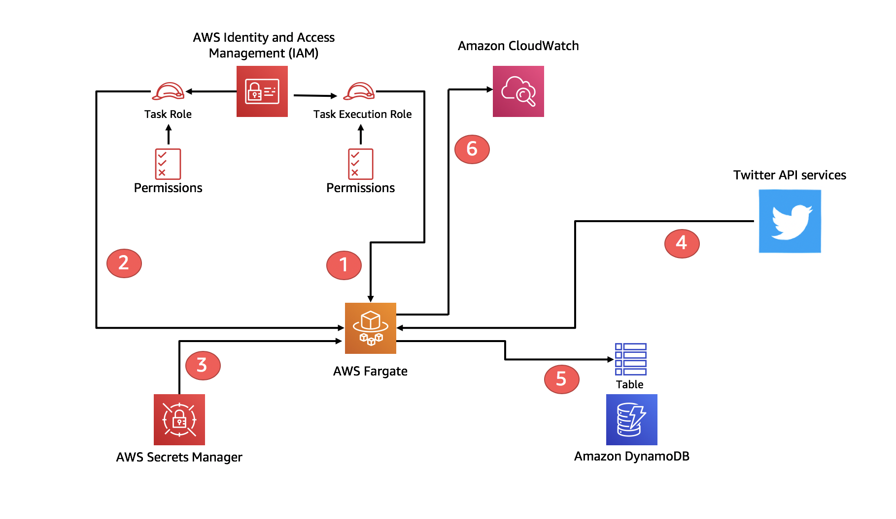
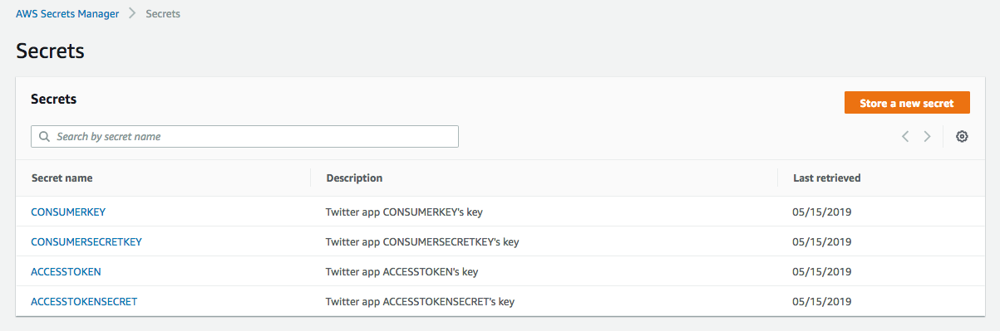

This is an example application that allows you to test Fargate with AWS Secrets Manager. 

#### What is this all about?

The architecture of the application is as follows:



The Fargate task contains a small Python application that reads a feed from Twitter and parse it through a `FILTER` (you can customize the filter in the `twitterstream-task.json` file otherwise the default `Amazon` value will be used). Some of the fields of the filtered data set are saved into a DynamoDB table. 

The python script that reads the feed and puts the filtered data set into the database is based off of [this code](https://github.com/tweepy/tweepy/blob/master/examples/streaming.py) in the `tweepy` GitHub [repo](https://github.com/tweepy/tweepy).

Ultimately this example is aimed at underlining how the Fargate IAM task role can be used to mediate the access to AWS services (DynamoDB in this case), while the integration with AWS Secrets Manager allows for storing securily third party credentials (Twitter in this case). 

#### Setup instructions

Note I have only tested this from a Cloud9 environment (nee Linux). I haven't tested it on a Mac. You have to have an up-to-date `AWS CLI` installed and configured with a user or role that has enough permissions in your account.  There are other tools that need to be installed (i.e. `docker`, `sed` and `jq`). The Docker runtime is required because the script builds the container image on the fly. 

You also need to set these systems variables. The subnets and security group can be the default one in the default VPC in the region of your choice: 

```
export AWSACCOUNT=123456789012
export SUBNET1=subnet-87654321
export SUBNET2=subnet-12345678
export SECURITYGROUP=sg-12345678
export REGION=us-west-2
```

The script takes care of everything but the storing of your Twitter credentials in AWS Secrets Manager. You can grab those on the [developer.twitter.com](https://developer.twitter.com) portal (requires registration).

You can do this via the Console or via the CLI. This is how you'd set them programmatically:
```
aws secretsmanager create-secret --name CONSUMERKEY \
    --description "Twitter API Consumer Key" \
    --secret-string <your consumer key here> 
aws secretsmanager create-secret --name CONSUMERSECRETKEY \
    --description "Twitter API Consumer Secret Key" \
    --secret-string <your consumer secret key here> 
aws secretsmanager create-secret --name ACCESSTOKEN \
    --description "Twitter API Access Token" \
    --secret-string <your access token here> 
aws secretsmanager create-secret --name ACCESSTOKENSECRET \
    --description "Twitter API Access Token Secret" \
    --secret-string <your access token secret here>
``` 

Note the names need to be prescriptive because the script goes search for those. Ultimately, your AWS Secrets Manager console should look like this before you run the script:



When you are set, clone this repo and run the `bringup.sh` script (it requires you to `chmod +x` it to make it executable). 

#### Clean up

The `teardown.sh` script will bring everything down in the reverse order. Anything that the `bringup.sh` script has created will be deleted (with the exception of the task definition, which could only be disabled but not deleted). The clean up script will not delete the Twitter API secrets in AWS Secrets Manager.

#### Known issues

- The Twitter API end-point is very sensitive to how the requesting traffic gets generated. Because of the nature of Fargate (that will spin up tasks with different public IP addresses that are the source of the traffic to the Twitter public API) Twitter may end up considering this a non legit use of a single set of application credentials thus inhibiting temporarely access to the Twitter API itself. Please consider this when you test the application and you run the tasks repeatidly in a short amount of time.    

- The scripts are pretty raw and without any particular error control. They were built mainly just for demonstration purposes. 
